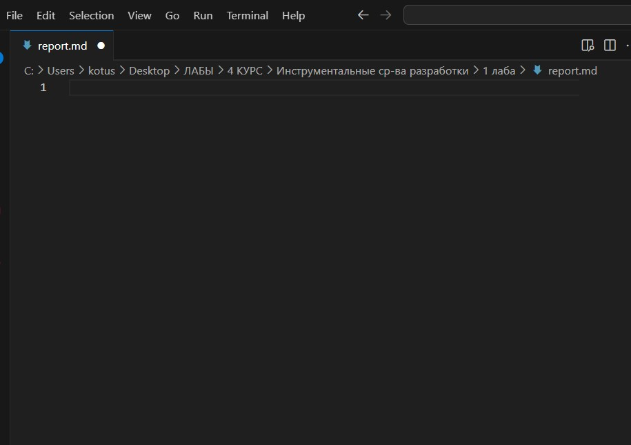
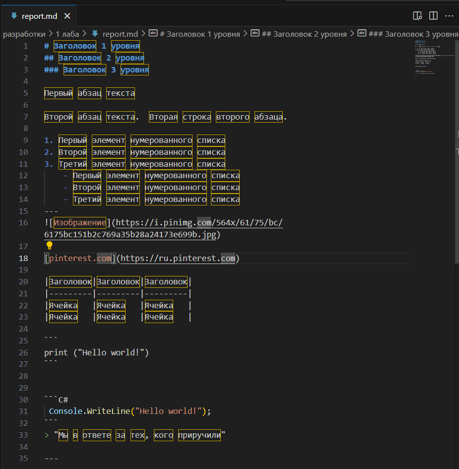
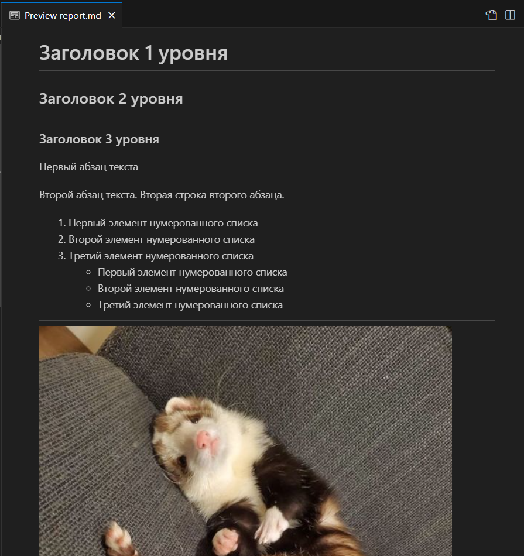
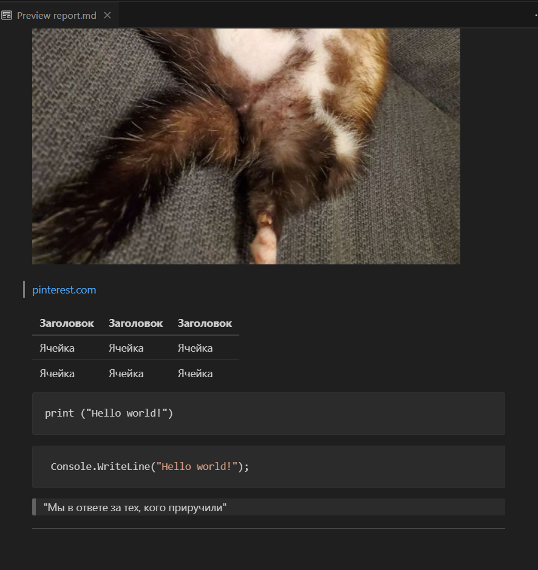

# Лабораторная работа №1 "Markdown"
**По дисциплине "Инструментальные средства разработки ПО** 

Работу выполнил судент  
группы *ИПсп-121*  
*Руденко Александра Максимовна*  

**03.09.24**

---
**Markdown** - это облегчённый язык разметки, который преобразует текст в структурированный HTML. Следующее руководство поможет вам разобраться, как использовать Markdown.

### Цель работы: 
1. Изучить основы работы с языком разметки Markdown
2. Научиться создавать и форматировать документы
---
### Ход работы:
- Создание файла с расширением `.md`
- Добавление в документ:
    - Заголовки (1-3 уровни)
    - Абзацы текста
    - Нумерованные, ненумерованные, вложенные списки
    - Вставка изображений
    - Вставка ссылок
    - Таблицы
    - Блоки кода
    - Цитаты
    - Горизонтальные линии

Листинг кода файла `report.md`:
```
# Заголовок 1 уровня
## Заголовок 2 уровня
### Заголовок 3 уровня
Первый абзац текста

Второй абзац текста.  
Вторая строка второго абзаца.
1. Первый элемент нумерованного списка
2. Второй элемент нумерованного списка
3. Третий элемент нумерованного списка
    - Первый элемент нумерованного списка
    - Второй элемент нумерованного списка
    - Третий элемент нумерованного списка
---


[pinterest.com](https://ru.pinterest.com)

|Заголовок|Заголовок|Заголовок|
|---------|---------|---------|
|Ячейка   |Ячейка   |Ячейка   |
|Ячейка   |Ячейка   |Ячейка   |

` ``
print ("Hello world!")
` ``
` ``C#
 Console.WriteLine("Hello world!");
` ``
> "Мы в ответе за тех, кого приручили"
---
```
**Скриншот созданного файла `report.md` :**



**Скриншот заполненного файла `report.md`:**



**Скриншоты предпросмотра документа:**



---
### Вывод: 
В ходе выполнения данной лабораторной работы на практике были изучены способы работы с языком разметки Markdown.