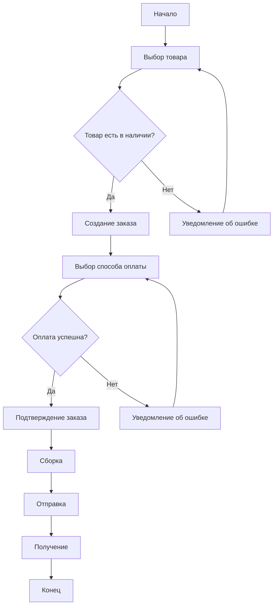

# <center> Руденко А.М. ИПсп-121 Индивидуальное задание 8 вариант </center>

## 1. Математические формулы: вставьте формулу для вычисления интеграла.

$∫e^x dx = e^x + C$

## 2. Диаграммы с Mermaid: создайте диаграмму активности процесса заказа.



## 3. Встроенный HTML: вставьте форму для подписки на новости.

<form>
  <label>Введите ваш email:</label><br>
  <input type="email"><br>
  <input type="submit" value="Подписаться">
</form>

## 4. Сложные таблицы: создайте таблицу с выравниванием текста для списка продуктов.  

|Название|Кол-во|
|--------:|:------:|
|Молоко|1|
|Хлеб|2|
|Кефир|1|

## 5. Галерея изображений: вставьте три изображения животных.


## 6. Вложенные списки: создайте список мероприятий с подкатегориями.
- Культурные мероприятия
   - Концерты
   - Театральные постановки
   - Выставки искусства
   - Кинофестивали

- Спортивные мероприятия
   - Командные виды спорта
   - Индивидуальные виды спорта
   - Марафоны и забеги
   - Турниры и чемпионаты

- Образовательные мероприятия
   - Семинары и мастер-классы
   - Конференции и форумы
   - Вебинары
   - Курсы и тренинги

- Развлекательные мероприятия
   - Праздники и фестивали
   - Тематические вечеринки
   - Игровые турниры
   - Выставки и ярмарки
  
## 7. Подсветка синтаксиса: вставьте блоки кода на Lua и Elixir.
```lua
-- Пример кода на Lua
function sumTable(numbers)
    local sum = 0
    for i, num in ipairs(numbers) do
        sum = sum + num
    end
    return sum
end
-- Пример использования функции
local myNumbers = {1, 2, 3, 4, 5}
local total = sumTable(myNumbers)

print("Сумма чисел в таблице: " .. total)
```
```elixir
  # Пример кода на Elixir
defmodule Math do
  def sum_list([]), do: 0
  def sum_list([head | tail]), do: head + sum_list(tail)
end
# Пример использования функции
numbers = [1, 2, 3, 4, 5]
total = Math.sum_list(numbers)

IO.puts("Сумма чисел в списке: #{total}")
```
## 8. Цитаты: вставьте цитату Льва Толстого.
> «Спасать можно человека, который не хочет погибать».

## 9.  Таблицы и содержания: создайте автоматическую таблицу содержания.
- [ Руденко А.М. ИПсп-121 Индивидуальное задание 8 вариант ](#-руденко-ам-ипсп-121-индивидуальное-задание-8-вариант-)
  - [1. Математические формулы: вставьте формулу для вычисления интеграла.](#1-математические-формулы-вставьте-формулу-для-вычисления-интеграла)
  - [2. Диаграммы с Mermaid: создайте диаграмму активности процесса заказа.](#2-диаграммы-с-mermaid-создайте-диаграмму-активности-процесса-заказа)
  - [3. Встроенный HTML: вставьте форму для подписки на новости.](#3-встроенный-html-вставьте-форму-для-подписки-на-новости)
  - [4. Сложные таблицы: создайте таблицу с выравниванием текста для списка продуктов.](#4-сложные-таблицы-создайте-таблицу-с-выравниванием-текста-для-списка-продуктов)
  - [5. Галерея изображений: вставьте три изображения животных.](#5-галерея-изображений-вставьте-три-изображения-животных)
  - [6. Вложенные списки: создайте список мероприятий с подкатегориями.](#6-вложенные-списки-создайте-список-мероприятий-с-подкатегориями)
  - [7. Подсветка синтаксиса: вставьте блоки кода на Lua и Elixir.](#7-подсветка-синтаксиса-вставьте-блоки-кода-на-lua-и-elixir)
  - [8. Цитаты: вставьте цитату Льва Толстого.](#8-цитаты-вставьте-цитату-льва-толстого)
  - [9.  Таблицы и содержания: создайте автоматическую таблицу содержания.](#9--таблицы-и-содержания-создайте-автоматическую-таблицу-содержания)
  - [10.  Эмодзи и спец. символы: вставьте эмодзи для обозначения успеха.](#10--эмодзи-и-спец-символы-вставьте-эмодзи-для-обозначения-успеха)

## 10.  Эмодзи и спец. символы: вставьте эмодзи для обозначения успеха.  
:+1: :white_check_mark:
